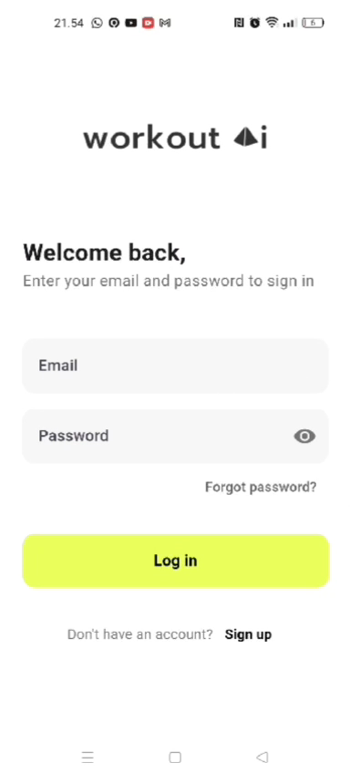

# Workout AI Monitor 💪

[]()
[](https://flutter.dev/)
[](https://developers.google.com/ml-kit)

## 🎯 Project Vision

We're transforming manufacturing equipment monitoring by adapting advanced movement detection technology, initially proven through exercise tracking, to create an innovative solution for real-time machinery health monitoring.

### 💡 Innovation Highlight
Our unique approach demonstrates how human movement analysis technology can be adapted to monitor mechanical movements, providing:
- Real-time anomaly detection
- Pattern-based prediction

## 🎥 Demo Setup

<a href="https://drive.google.com/file/d/1RjME5DJMyukPOe5sMGEFG8VQvNoyjhWw/preview" target="_blank" style="position: relative; display: inline-block;">
    
</a>

## ⚙️ Current Implementation


### Demo Features
Our prototype currently demonstrates capability through:
- Real-time movement tracking using ML Kit
- Pattern recognition and analysis
- Performance monitoring dashboard
- Instant anomaly detection

```dart
Key endpoints for integration:

Base URL: https://backend-workout-ai.vercel.app/api

Authentication:
POST /userInfo    - Register monitoring system
POST /login       - System authentication
DELETE /logout    - End monitoring session

Monitoring:
POST /pushup      - Submit movement data
GET /getWoInfo    - Retrieve monitoring history
```

## 🚀 Technology Stack

### Core Technologies
- **Frontend:** Flutter
- **Vision Analysis:** Google ML Kit
- **Pattern Recognition:** Custom algorithms
- **Real-time Processing:** Native integration

### Key Components
- Movement pattern detection
- Real-time analysis engine
- Performance analytics
- Alert system

## 📊 Technical Demonstration

### Pattern Recognition
```dart
// Example of our pattern detection system
final bloc = BlocProvider.of<PushUpCounter>(context);
      for (final pose in widget.posePainter!.poses) {
        PoseLandmark getPoseLandmark(PoseLandmarkType type1) {
          final PoseLandmark joint1 = pose.landmarks[type1]!;
          return joint1;
        }

        p1 = getPoseLandmark(PoseLandmarkType.rightShoulder);
        p2 = getPoseLandmark(PoseLandmarkType.rightElbow);
        p3 = getPoseLandmark(PoseLandmarkType.rightWrist);
      }
      if (p1 != null && p2 != null && p3 != null) {
        final rtaAngle = utils.angle(p1!, p2!, p3!);
        final rta = utils.isPushUp(rtaAngle, bloc.state);
        print("Angle: ${rtaAngle.toStringAsFixed(2)}");
        if (rta != null) {
          if (rta == PushUpState.init) {
            bloc.setPushUpState(rta);
          } else if (rta == PushUpState.complete) {
            bloc.incrementCounter();
            bloc.setPushUpState(PushUpState.neutral);
          }
        }
      }

```

## Monitoring History
```dart
// Example of our monitoring history
GET https://backend-workout-ai.vercel.app/api/getWoInfo
```


1. Install dependencies:
```bash
flutter pub get
```

2. Run the application:
```bash
flutter run
```


3. Access the monitoring dashboard:
   - Launch application
   - Login with provided credentials
   - Start monitoring session


## 🔄 Manufacturing Adaptation

Our exercise monitoring system demonstrates key capabilities needed for equipment monitoring:

| Exercise Feature | Manufacturing Application |
|-----------------|--------------------------|
| Movement Detection | Equipment Operation Tracking |
| Form Analysis | Movement Pattern Analysis |
| Rep Counting | Cycle Monitoring |

## 📈 Business Impact

### Cost Reduction
- Minimize unplanned downtime
- Reduce maintenance costs
- Prevent major equipment failures

### Efficiency Improvement
- Real-time monitoring capability
- Predictive maintenance
- Performance optimization

## 🛠️ Project Structure
```
lib/
├── models/         # Data models
├── services/       # API integration
├── utils/          # Analysis tools
├── views/          # Monitoring interfaces
├── widgets/        # UI components
└── painters/       # Visual overlays
```

## 🎯 Future Development

### Planned Enhancements
- Equipment-specific adaptations
- Advanced pattern recognition
- IoT sensor integration
- Expanded analytics dashboard

## 🤝 Contact

For hackathon-related inquiries:
- Team Name: [Workout.ai]
- Contact: [amaralkaff@gmail.com]

## 📝 License
This project is licensed under the MIT License

## Link Github
[Github](https://github.com/amaralkaff/WorkOut.ai)
